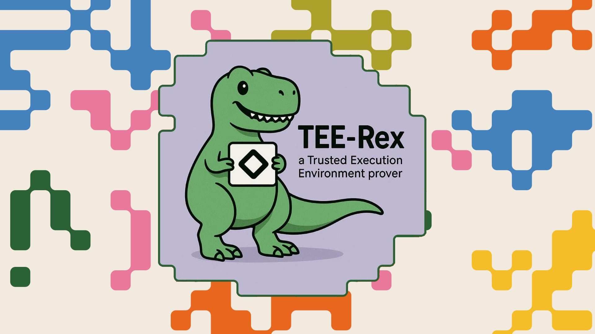

  

  <h1>TEE-Rex</h1>

  

    <strong>A TEE-based prover for Aztec transactions</strong>
  

Prove [Aztec](https://aztec.network) transactions in a TEE. Read the [SDK docs](sdk/README.md) to get started.

## Features

- Delegate Aztec transaction proving to a TEE
- Encrypt sensitive data with TEE-generated encryptions keys
- Easy to plug into your PXE ([SDK docs](sdk/README.md))
- Use a hosted TEE or run your own
- Fallback to local proving if the TEE is not available

## Contributors

Made with ❤️ by [Nemi](https://nemi.fi) 🦖.
